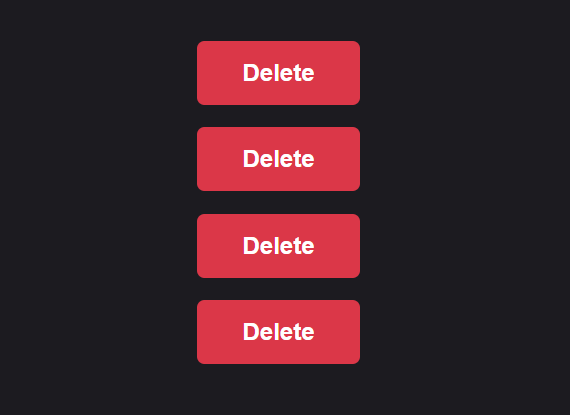
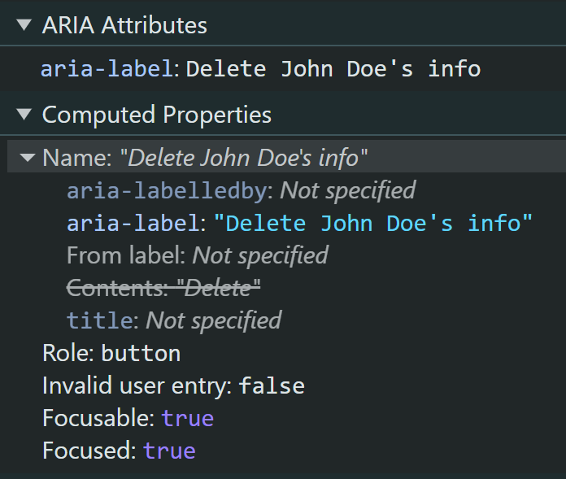
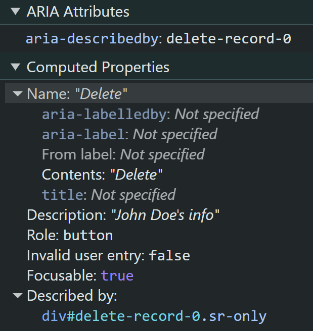

Using aria-labels can expose sensitive data to tracking software.

While this applies to interactive controls in general, for this specific scenario, I’m using buttons and their labels. Let’s say in your app, you have a series of buttons with the same icon or label, such as a trash can or the word “Delete”. When pressed, this button will delete some person’s info from the application. For someone who’s sighted, it’s possible for them to understand the context and complete the action with confidence. But what about someone who is using a screen reader? The issue is that some screen reader users will not be able to tell each of these buttons apart because the names are not unique. In addition, the word “Delete” doesn’t provide enough context. If the user can’t perceive the surrounding content, we can’t assume that they know exactly what’s being deleted.



So what’s a possible solution for providing context? Well, in a perfect world, you can make each label unique, and that’s it. Problem solved. But, in this world, the unique identifiers are the various account names, which can be too long, have inconsistent lengths; all preventing them from being used as labels or as tooltip copy. So the Designer has chosen to use “Delete” as the label instead. The Developer then chooses to use an `aria-label` to provide the additional context, thus making each button label unique. As an [ARIA attribute that’s well supported](https://caniuse.com/mdn-api_element_arialabel), this [would definitely work](https://www.w3.org/TR/accname-1.1/#mapping_additional_nd_te). However, there’s an unexpected consequence. Each button has custom event tracking that grabs the label, which exposes sensitive data. This is because the `aria-label` now serves as the control’s name.

What does this look like? Imagine we have a semantic `<button>` with a label or a nested `` that renders the trash can SVG.

```xml
// Semantic button with label
<button type="button" class="delete__button" aria-label="Delete John Doe's info">
    Delete
</button>

// Semantic button with icon
<button type="button" class="delete__button" aria-label="Delete John Doe's info">
    
</button>
```

In the examples above, given that the person’s name for each instance of the button will be different, the `aria-label` holds the unique label text that provides the correct context. There’s nothing wrong with this implementation in general. However, if the interaction with each button is being tracked, the person’s name or Personal Identifiable Information (PII) is now exposed. The image below shows how the `aria-label` is computed and made available. The Name of the button is now “Delete John Doe's info,” and the “Contents” property is ignored.



Let’s take a look at a workaround to prevent this privacy leak. In this example, we’ll use the `aria-describedby` to provide additional context for the button.

```xml
// Semantic button with label
<div class="sr-only" id="delete-record-0">John Doe's name</div>
<button type="button" class="delete__button" aria-describedby="delete-record-0">
    Delete
</button>

// Semantic button with icon
<div class="sr-only" id="delete-record-1">Delete John Doe's name</div>
<button type="button" class="delete__button" aria-describedby="delete-record-1">
    
</button>
```

Taking another look at the computed properties in DevTools shows us that the user’s PII is no longer exposed in the label, the Name of the button is retained, and the “Description” property provides the additional context for the screen reader user.



With the ability to add custom tracking attributes outside of using `aria-labels`, extra care should be taken when considering the values used. [Exposing PII](https://www.ibm.com/reports/data-breach) is not only costly but can also damage the company’s brand image and public trust. Overall, the goal should be to avoid exposing PII and right bad code.
