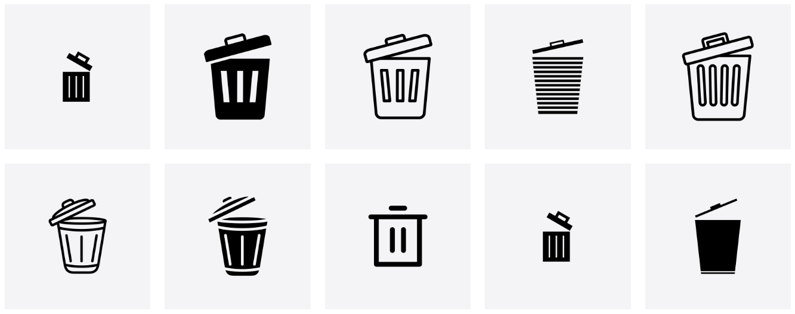
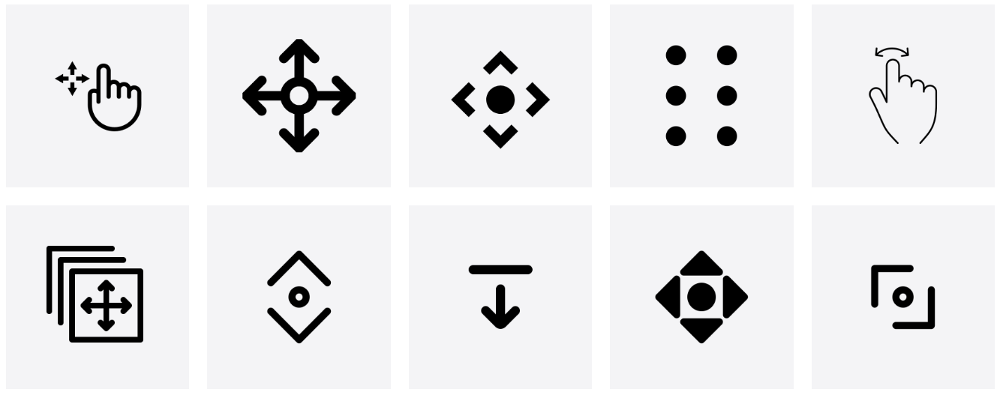
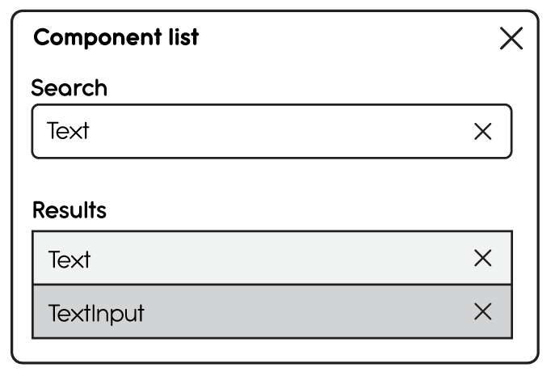
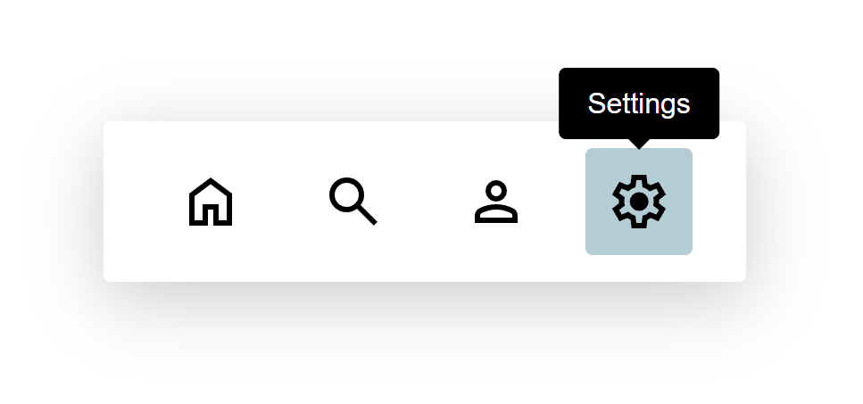

It’s estimated that modern-day humans have been [using images to communicate](https://pmc.ncbi.nlm.nih.gov/articles/PMC11269172/) for at least 51,000 years. Our brains are wired to perceive and recognize shapes as forms of communication. Visual stimuli are processed through our visual cortex, routed to the hippocampus, and stored in our short-term memory until they’re reinforced, becoming long-term memory. This reinforcement happens through rehearsal. The more we’re exposed to a particular visual stimulus and its various characteristics or memory cues, the more familiar we become with it and its perceived meaning.

As children, we learned about primitive shapes, and over time, we learned how these primitives are used to construct more complex objects. For example, your ability to read these words is evidence of this. Think of each letter as a primitive shape. We didn’t learn words initially. We learned to recognize and comprehend one respective symbol at a time. While studying Japanese, I learned to recognize and comprehend each logogram as two letters that formed a syllable. Just as with English, we learned to recognize the unique differences of each letter. Each characteristic of the letter is a contextual cue encoded into a schema so we can label and recognize each one. We then learned to string these letters together in a similar process so we could recognize each string as an individual word with its own shape, name, and sound.

Our ability to use prior knowledge of something by using schemas is known as top-down processing. An example of this is how we can tell the difference between a capital “I” and the number “1”. The inverse of this, as you may have guessed, is bottom-up processing. Bottom-up requires us to process external cues in order to understand what we are perceiving. Looking at the capital “I” in the word “Interstellar” and the lowercase “l” as in “love”, though with this font, they look the same, we use context to determine the correct letter. But what if you didn’t have the correct context for the number “one” and you saw “I2345”? The letter could easily be mistaken for a number because of the context in which it’s presented.

This is the same way we process icons on applications and websites. We use icons in our designs because they take up less space than text labels. And when designed well, they make our UI appear cleaner and easier to scan. When we’re using an app or visiting a website that uses icons for various reasons, we look for cues that match our schemas in order to understand the icon’s meaning. Our schemas are formed by our experiences with other apps, websites, and the real world. In many cases, we’re able to correctly identify familiar icons that match or are visually and functionally similar to their real-world counterpart without much effort using our top-down processes.

For example, the icons below are recognizable because they resemble their real-world counterpart, and we can infer the action they represent. I’m deliberately not specifying what these icons represent so you can experience your own awareness.

_Icons are from the Noun Project_

The more characteristics we can perceive, the stronger the encoding, which increases the likelihood of us identifying and understanding what the icon means.

Now, let’s look at another set of icons. Chances are, these are a bit harder to understand. 1. Because they don’t resemble a real-world object. And 2. they have similar characteristics, but are very different. To get a better understanding, we probably need to look at all the icons (bottom-up) to figure out the context. The more creative license we take when designing or choosing an icon from a library for a particular metaphor or action, the harder it is for our users to understand its meaning. It’s this fragmentation and a lack of standards that make icon recognition difficult for some people.

_Icons are from the Noun Project_

However, what about those times when we recognize an icon but don’t understand the context in which it’s used? Take this wireframe of a modal, for example. There are four “X”s used to convey some sort of function. We may understand the icon in the top right corner of the modal to mean “Close”, but what about the others? They are the same shapes, but based on their context, they don’t share the same intent. We do know it’s destructive, but in what way? To gain more context, we’d have to click each element to learn what it does. This need to interact may not be ideal because it can lead to potential errors. This is where labels come in.

Simply having icon buttons in the UI without labels isn't enough. Using `aria-label`, `aria-labelledby`, and `aria-describedby` without a visible label is not enough because they alone don’t serve all users. For example, an `aria-label` on an Icon Button is only exposed to people who use assistive tech. What about the sighted user with short-term memory loss due to Long-COVID?

Labels serve as memory and visual aids to help us understand the esoteric shapes we’re looking at. Without them, [Icon buttons aren’t accessible](https://www.w3.org/WAI/WCAG21/Understanding/sensory-characteristics.html). This is not to say that labels are the only key to understanding and acceptance. A designer still has to choose an icon that best represents the real-world function it serves. No matter how well the icons are designed, their purpose could still be misunderstood.

The label text should state the button’s intent instead of describing the icon itself. For example, if pressing the button with the gear opens the settings menu, the label should read “Settings” rather than “Gear” or “Gear icon”. While it's important to be descriptive, avoid including unnecessary details that don't add value.

As mentioned earlier, the user must have prior knowledge of the icon's meaning, and that knowledge can’t be guaranteed. A tooltip label will add context for all users and improve the overall user experience.
