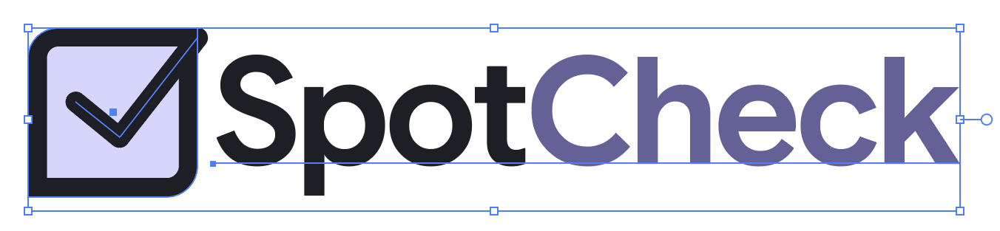
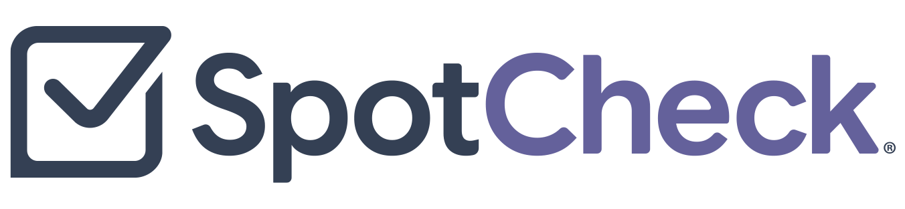
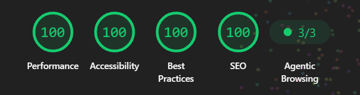

## Necessity is the mother of invention

I launched a product by accident, all because of a conversation I had with a coworker. She’s a huge fan of accessibility focused Bookmarklets and was showing off some of the ones she uses in her workflow. For me, I never gave them much thought, but I recognize others find them to be useful. The attraction towards them sparked my curiosity, and what began as a small side project became something much more.

I say “small side project” because it started out as me just reading and doing a bit of research on the topic. Days later, I had a need which turned into my first Bookmarklet born out of necessity. Back in late April, I was reviewing a website and noticed something odd. The developer had used unordered lists to organize content, but styled the lists to look like paragraph text. Needless to say, this was a code smell. Could I have looked at the DOM? Yep, but I wanted to be able to spot the issue quickly because I had a bunch of pages to review and the issue could appear anywhere in the files. So… since I wasn’t able to visually tell a list from paragraph copy, I made a really rough Bookmarklet to highlight any unordered list on the page.

## Pressing on

Accessibility audit tools aren’t new, and Bookmarklets aren’t new by any means. They’ve been around for over 30 years. They’re blocks of JavaScript code focused on executing a particular function in the context of the current webpage. So why not just use one that exists already? I could have. When I first considered making my first one, doubt popped its ugly head over my shoulder. That’s because in the past, whenever I mentioned wanting to do or build something, someone always questioned why, insinuating that I shouldn’t. The web has been my playground for over 30 years, and the learning process of building a Bookmarlet is new to me. So why pass up an opportunity to tinker? Many of the things I build are out of necessity. In fact, the first website I ever built in 1994 was becasue I wanted to have an online gallary to show my Mom’s art and mine. So if I build a tool that I find helpful, why not share it? After I quickly expelled the inner naysayer, down the proverbial rabbit hole I jumped.

## Workflows

As I mentioned earlier, I’ve never been a fan of Bookmarklets, but I get the appeal. They have a small footprint and very low overhead. Point, click, go! For my process, however, the interaction is clunky. To keep them handy, the Bookmarklet would have to live directly on my browser’s bookmark bar. I keep bookmarks like people keep browser tabs open. And because the bookmark bar is linear, with all the other bookmarks I have, that would be a cluttered mess. So I organize my bookmarks in folders. Well, now I have to open the folder, click the Bookmarklet every time I want to use it. To deactivate a Bookmarklet, I can either go through the steps to click it again or refresh the page. Again… not my ideal user experience. Now, drawing from my friend’s workflow, which is way different from mine, the Bookmarklets that I built allow for someone like her to perform quick spot-checks to find accessibility-related issues. While I was testing the first few, I knew I would have to make a DevTools version because that user experience aligns with my workflow. I was already familiar with the development process since I had released a <a href="https://www.colorblind.fyi" rel="noopener noreferrer" target="_blank">browser extension</a> with a companion site to help educated readers earlier this year, again, out of necessity. I just needed to think about how to approach this new challenge.

## Some ideas move fast

My ideas can be like Mogwai if I’m not careful. And in this case, I wasn’t. I broke two of the three rules. I got it wet and fed it after midnight. After being focused for a couple of months, I came up for air with a suite of Bookmarklets. And since I can’t help but add my professional touch, I knew I "needed" to buy a domain for this project. The initial name I gave the project for the sake of having a name was “Accessibility Bookmarklet Toolkit”. Couldn’t get any more literal than that. But from a domain and an overall branding perspective, this was awful. No matter how I spun it, it was never going to work.

## Branding

After having that brief conversation with Donnie, I asked myself what’s the purpose of this project, and these specific tools? What did they allow me to do? The answer… to spot-check accessibility issues. And that was it! What was an evening that was winding down suddenly was energized again by my excitement. I turned my computer back on and hunted for the perfect domain name. Domain purchased, now I need a logo! So I cracked open Adobe Illustrator and got to work.

### Typeface specs:

- I wanted the letters to have some weight
- Be symmetrical
- Rounded / curved edges

I could picture what I wanted, so the first iteration came together quickly. While I was happy with it, I’m not a rookie logo designer, and I knew not to fixate on the first idea. Sometimes I’ll sketch out my ideas in my notebook, but I also like iterating directly in Illustrator. That way, what I’m working on is closer to being real. I started with the typeface. After establishing a base, I started working on the logomark. After several iterations of it, I manipulated the typeface to take on characteristics of the mark and boom! The SpotCheck logo was done. I was so pleased with it, after sitting on it for a couple of days, I officially registered it.

#### First logo iteration

#### Final logo

## The website

I design websites in Photoshop or Figma, it just depends on my mood. But, being a developer, I also prefer to prototype with HTML and CSS for the same reason I iterate in Illustrator. The project is closer to being real because it’s in the medium it will eventually exist.

### Website specs:

- Accessible... duh!
- Single point, gallery style navigation so the tools are easy to find
- Template-based to keep the structure and information organized and consistent
- Educational becasue I want users to understand how each tool is realted to the Web Content Accessibility Guidelines (WCAG 2.2)
- Informative for all skill levels so the user has some insight about semantic markup and the results of the tests.

Since the Bookmarklet pages were going to be content heavy, I started with that template first. Borrowing from my experience building design systems and writing documentation, I had a good idea of what I wanted on the page. I also specifically wanted the content to be approachable and not aimed at any one discipline. I found myself shuffling sections around like a shell game to land the correct balance. Literally pixel pushing with code.

After the template was done, I moved on to the home page which was as straight forward as could be.

- Logo
- Product blurb
- Stats for the stat folks
- Tool gallary
- My wife, who is also a skilled designer and one of my beta testers, suggested the "About this toolkit" section
- Vanity links and copyright

I’m somewhat back in <a href="https://www.homergaines.com" rel="noopener noreferrer" target="_blank">my minimalist design phase</a>, so I kept the design pretty light. Solid colors with hints of the logomark’s shape incorporated into the Cards. I kept it so simple. I didn’t even add dark mode support until after Charles Hall suggested it after I showed him the DevTools prototype. I knew that when the time came for me to add the DevTools section, that would require a bit more design and polish, so I saved the heavier creative push for then. A couple of days later, I thought to add a bit more personality, so I added some microinteractions and a few Easter eggs just for fun. I know for certain one Easter egg was found because Accessibility Engineers are a curious and nosy bunch, and a developer DM’d me a humorously colorful message on Slack.

Some may be wondering if AI played a part in any of this? Yep! I used it for the boring parts. The `sitemap.xml`, `llms.txt`, `robots.txt`, and the percent-encoding of the JS for the Bookmarklets were generated using Claude because I really didn’t feel like typing all of that. Copilot and its magical text suggestions helped speed up the CSS parts, like dropping the correct tokens in when needed.

In addition to manual testing with JAWS and NVDA, I ran axe DevTools against the code to check for any accessibility issues. And just for giggles, I ran Lighthouse against it as well.

## The realization

It’s now the first weekend in August, and I’ve shared <a href="https://www.spotcheck.tools" rel="noopener noreferrer" target="_blank">SpotCheck</a> with my coworkers and got their opinons and feedback. I’m standing in my kitchen, and it dawned on me… I just launched a product. I didn’t plan on it. I just wanted to build something to help me solve a quick problem. When others expressed interest, that “something” evolved into a set of tools that other accessibility professionals are actually using, which I think is pretty cool.

## So, what's next?

Since the launch of the website and the original Bookmarklets, I've launched the Devtools version for <a href="https://chromewebstore.google.com/detail/spotcheck-accessibility-t/bcaahjkiibfcphmllamggoneejgpkncf?authuser=0&hl=en" rel="noopener noreferrer" target="_blank">Chrome</a>, <a href="https://microsoftedge.microsoft.com/addons/detail/spotcheck-accessibility-/emnckkeinmbibkdihlafebegipoojcdb" rel="noopener noreferrer" target="_blank">Edge</a>, and <a href="https://addons.mozilla.org/en-US/firefox/addon/spotcheck-a11y-toolkit/" rel="noopener noreferrer" target="_blank">Firefox</a>. At the request of a user, I added the <a href="https://www.spotcheck.tools/target-size-checker" rel="noopener noreferrer" target="_blank">Target Size Checker</a>. Coming down the pipe, I have some bugs to fix and I'm also considering rebuilding the site using Astro.
